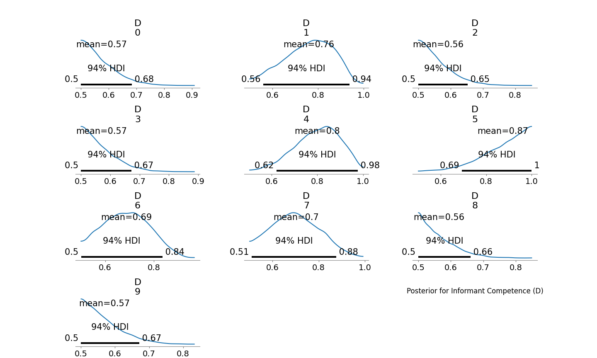

# CCT Midterm - Emelyn Ochoa

## Objective

This project implements the basic Cultural Consensus Theory (CCT) model using PyMC to analyze plant knowledge data, estimating consensus answers and individual competence.

**Model**

The Cultural Consensus Theory (CCT) model was implemented using a Bernoulli likelihood. For informant competence (D), a Uniform prior (0.5 to 1) was chosen, reflecting knowledge better than chance. For consensus answers (Z), a non-informative Bernoulli(0.5) prior was used.

**Results**

POSTERIOR FOR INFORMANT COMPETENCE (D):

POSTERIOR FOR CONSENSUS ANSWERS (Z):

**Interpretation**

The model yielded posterior mean competence estimates ranging from 0.56 (Informant 3) to 0.87 (Informant 6), this suggests different levels of knowledge among the informants (regarding plant identification). The consensus answers, showed notable differences when compared to majority vote of the responses. For example, for Items 2, 6, 8, 10, and 14, the CCT model predicted a consensus answer of 1, while the majority vote was 0. These differences suggest that the CCT model, by taking into account competence, produces a consensus that's different from simply averaging all responses. Specifically, in these cases, the more competent informants (like Informant 6) likely showed a pattern of agreement on the answer that was not the most frequent response in the overall group. 

This shows the CCT model's ability to reveal a "correct" answer which might otherwise be hidden by the opinions of less "competent" individuals in a majority vote.

## GitHub Repo Link:

[(https://github.com/emelynochoaa/cct-midterm/tree/main/cct-midterm/data)]